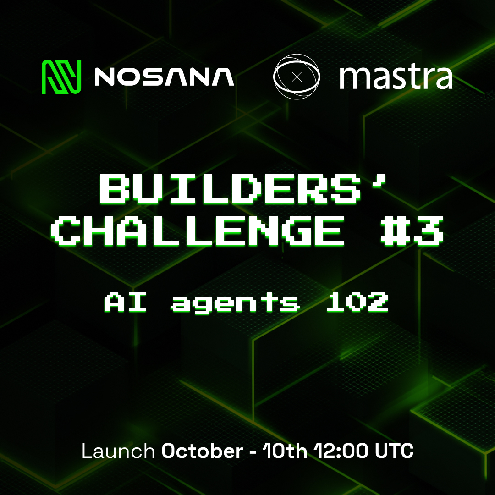

# Repo-Agent: AI GitHub Repository Assistant 🤖



An intelligent AI agent that helps you explore, understand, and navigate your GitHub repositories through natural conversation. Built with [Mastra](https://mastra.ai) and deployed on the [Nosana](https://nosana.io) decentralized compute network.

## 📖 Agent Description & Purpose

**Repo-Agent** is an AI-powered GitHub assistant that makes it easy to interact with your repositories using natural language. Instead of manually browsing through files and folders, simply ask questions about your codebase and get instant, context-aware answers.

### Key Features

- 🔍 **Intelligent Repository Search** - Search and filter through all your GitHub repositories
- 📂 **Interactive File Browser** - Navigate your repository structure with an intuitive tree view
- 💬 **AI Chat Interface** - Ask questions about your code, files, and repository structure
- 🔐 **Secure GitHub OAuth** - Safe authentication with your GitHub account
- 📝 **File Content Viewer** - Read file contents with syntax highlighting
- 🎯 **Context-Aware Responses** - The agent understands your current repository and file context

### Use Cases

- Understand unfamiliar codebases quickly
- Get explanations of specific files or code sections
- Find dependencies and configuration files
- Analyze repository structure and organization
- Get coding best practices and improvement suggestions

## 🛠️ Tools & APIs Used

### Core Technologies

- **[Mastra](https://mastra.ai)** - AI agent orchestration and tool management
- **[OpenAI GPT-4](https://openai.com)** - Large language model for intelligent responses
- **[Next.js 15](https://nextjs.org)** - React framework for the frontend
- **[GitHub API](https://docs.github.com/en/rest)** - Access to repositories and file contents
- **[GitHub OAuth](https://docs.github.com/en/apps/oauth-apps)** - Secure user authentication

### Custom Mastra Tools

The agent uses three custom-built tools:

1. **getUserRepositories** - Fetches authenticated user's GitHub repositories with search filtering
2. **getRepositoryContents** - Retrieves directory contents and file structure
3. **getFileContent** - Reads raw file contents from repositories

### Additional Features

- **OpenAI Realtime API** - Voice interaction capabilities (experimental)
- **Tailwind CSS** - Modern, responsive UI design
- **React Three Fiber** - 3D visualizations

## 🚀 Setup Instructions

### Prerequisites

Before you begin, ensure you have the following installed:

- **Node.js** (v18 or higher)
- **pnpm** (v8 or higher) - `npm install -g pnpm`
- **GitHub Account** - For OAuth authentication
- **OpenAI API Key** - Get one from [OpenAI Platform](https://platform.openai.com)

### Step 1: Clone the Repository

```bash
git clone https://github.com/YOUR-USERNAME/repo-agent
cd repo-agent
```

### Step 2: Install Dependencies

```bash
pnpm install
```

### Step 3: Configure Environment Variables

Copy the example environment file and update with your credentials:

```bash
cp .env.example .env
```

See the [Environment Variables](#-environment-variables-required) section below for details on each variable.

### Step 4: Set Up GitHub OAuth Application

1. Go to [GitHub Settings > Developer Settings > OAuth Apps](https://github.com/settings/developers)
2. Click "New OAuth App"
3. Fill in the details:
   - **Application name**: Repo-Agent (or your preferred name)
   - **Homepage URL**: `http://localhost:3000`
   - **Authorization callback URL**: `http://localhost:3000/api/auth/github/callback`
4. Click "Register application"
5. Copy the **Client ID** and generate a **Client Secret**
6. Add these to your `.env` file

### Step 5: Start the Application

Run both the Mastra agent server and Next.js UI:

```bash
# Terminal 1 - Start Mastra Agent Server (port 4111)
pnpm run dev:agent

# Terminal 2 - Start Next.js UI (port 3000)
pnpm run dev:ui
```

Or run both simultaneously:

```bash
pnpm run dev
```

### Step 6: Access the Application

- **Frontend UI**: Open [http://localhost:3000](http://localhost:3000)
- **Mastra Playground**: Open [http://localhost:4111](http://localhost:4111)

## 🔑 Environment Variables Required

Create a `.env` file in the root directory with the following variables:

### Required Variables

```env
# OpenAI Configuration (Required for AI chat)
OPENAI_API_KEY=sk-your-openai-api-key-here

# GitHub OAuth (Required for authentication)
GITHUB_CLIENT_ID=your-github-client-id
GITHUB_CLIENT_SECRET=your-github-client-secret
GITHUB_REDIRECT_URI=http://localhost:3000/api/auth/github/callback

# Logging
LOG_LEVEL=info
```

### Optional Variables (Alternative LLM Options)

```env
# Option 1: Use Nosana's Free LLM Endpoint (for development)
# OLLAMA_API_URL=https://3yt39qx97wc9hqwwmylrphi4jsxrngjzxnjakkybnxbw.node.k8s.prd.nos.ci/api
# MODEL_NAME_AT_ENDPOINT=qwen3:8b

# Option 2: Use Local Ollama Instance
# OLLAMA_API_URL=http://127.0.0.1:11434/api
# MODEL_NAME_AT_ENDPOINT=qwen3:0.6b
```

### Variable Descriptions

| Variable | Description | Example |
|----------|-------------|---------|
| `OPENAI_API_KEY` | OpenAI API key for GPT-4 | `sk-proj-...` |
| `GITHUB_CLIENT_ID` | GitHub OAuth App Client ID | `Iv1.a1b2c3d4e5f6g7h8` |
| `GITHUB_CLIENT_SECRET` | GitHub OAuth App Client Secret | `a1b2c3d4e5f6g7h8i9j0k1l2m3n4o5p6q7r8s9t0` |
| `GITHUB_REDIRECT_URI` | OAuth callback URL | `http://localhost:3000/api/auth/github/callback` |
| `LOG_LEVEL` | Application logging level | `info`, `debug`, `error` |

## 💡 Example Usage & Screenshots

### Getting Started

1. **Login with GitHub**
   - Click the "Login with GitHub" button in the top right
   - Authorize the application to access your repositories

2. **Search for a Repository**
   - Type the name of any of your repositories in the search bar
   - Select a repository from the dropdown results

3. **Explore the Repository**
   - Browse files and folders in the left sidebar
   - Click on files to view their contents in the middle panel
   - The file tree loads dynamically as you expand folders

4. **Chat with the AI Assistant**
   - Use the chat panel on the right to ask questions about your repository
   - The AI assistant has access to your repository structure and file contents

### Example Questions to Ask

```
"What does this repository do?"
"Explain the main dependencies in package.json"
"What files are in the src directory?"
"How is authentication implemented?"
"What's the purpose of the [filename] file?"
"What technologies are used in this project?"
"Suggest improvements for this codebase"
```

### Screenshots

#### Main Interface
The application features a three-panel layout:
- **Left**: Repository file tree browser
- **Middle**: File content viewer with syntax highlighting
- **Right**: AI chat assistant

#### Features in Action
- **Repository Search**: Search across all your GitHub repositories
- **File Navigation**: Click through folders and files in the tree view
- **AI Assistant**: Get intelligent answers about your codebase
- **Multiple File Tabs**: Open and switch between multiple files
- **Code Copying**: Copy file contents with one click

### Sample Workflow

```bash
# 1. User logs in with GitHub
# 2. Searches for "my-project"
# 3. Clicks on the repository
# 4. Browses to src/components/Button.tsx
# 5. Asks: "What props does this Button component accept?"
# 6. AI responds with detailed explanation of the component's interface
```

## 🐳 Docker Deployment

### Build Docker Container

```bash
# Build the container
docker build -t YOUR-USERNAME/repo-agent:latest .

# Test locally
docker run -p 3000:3000 \
  -e OPENAI_API_KEY=your-key \
  -e GITHUB_CLIENT_ID=your-id \
  -e GITHUB_CLIENT_SECRET=your-secret \
  -e GITHUB_REDIRECT_URI=http://localhost:3000/api/auth/github/callback \
  YOUR-USERNAME/repo-agent:latest

# Push to Docker Hub
docker login
docker push YOUR-USERNAME/repo-agent:latest
```

## 🚀 Deploying to Nosana

Deploy your Repo-Agent on the Nosana decentralized compute network!

### Using Nosana Dashboard

1. Open [Nosana Dashboard](https://dashboard.nosana.com/deploy)
2. Click `Expand` to open the job definition editor
3. Edit `nos_job_def/nosana_mastra_job_definition.json` with your Docker image:
   ```json
   {
     "image": "YOUR-USERNAME/repo-agent:latest"
   }
   ```
4. Copy and paste the edited job definition
5. Select a GPU (recommended: nvidia-3090 or higher)
6. Click `Deploy`
7. Wait for deployment to complete and get your public URL

### Using Nosana CLI (Alternative)

```bash
# Install Nosana CLI
npm install -g @nosana/cli

# Deploy your agent
nosana job post --file ./nos_job_def/nosana_mastra_job_definition.json --market nvidia-3090 --timeout 30
```

### Important Notes for Deployment

- Ensure all environment variables are properly set in your deployment
- Update `GITHUB_REDIRECT_URI` to match your Nosana deployment URL
- The deployed version includes the LLM model in the container for self-contained operation

## 🎯 Project Architecture

```
repo-agent/
├── src/
│   ├── app/                    # Next.js pages and API routes
│   │   ├── api/
│   │   │   ├── agent/         # AI agent chat endpoint
│   │   │   ├── auth/          # GitHub OAuth endpoints
│   │   │   ├── repos/         # Repository search
│   │   │   ├── repo-contents/ # File tree endpoints
│   │   │   └── file-content/  # File reading endpoint
│   │   └── page.tsx           # Main application UI
│   ├── components/            # React components
│   │   ├── ChatUI.tsx         # Chat interface
│   │   ├── LoginButton.tsx    # Authentication
│   │   └── RepoSearch.tsx     # Repository search
│   ├── mastra/                # Mastra configuration
│   │   ├── agents/            # AI agent definitions
│   │   ├── tools/             # Custom tool implementations
│   │   └── mcp/               # MCP client setup
│   └── lib/                   # Utility functions
│       ├── github.ts          # GitHub API integration
│       └── mastraClient.ts    # Mastra client setup
├── Dockerfile                 # Container configuration
└── package.json              # Dependencies
```

## 🤝 Contributing

Contributions are welcome! If you'd like to improve Repo-Agent:

1. Fork the repository
2. Create a feature branch (`git checkout -b feature/amazing-feature`)
3. Commit your changes (`git commit -m 'Add amazing feature'`)
4. Push to the branch (`git push origin feature/amazing-feature`)
5. Open a Pull Request

## 📄 License

This project is licensed under the MIT License - see the [LICENSE](LICENSE) file for details.

## 🆘 Support & Community

### About Nosana Builders Challenge

**Submission Links:**
- 📱 [Social Media Post on Bluesky](https://bsky.app/profile/did:plc:3fhiic2kdjbsmxeihyntn6hs/post/3m4je6p4mdf23)
- 🎥 **Demo Video**: [Coming Soon - Add your demo video link here]

## 🙏 Acknowledgments

- **Nosana** - For providing the decentralized compute infrastructure
- **Mastra** - For the excellent AI agent framework
- **OpenAI** - For GPT-4 and the Realtime API
- **GitHub** - For the comprehensive API and OAuth system
- **Nosana Community** - For support and feedback during development

---

**Built with ❤️ for the Nosana Builders Challenge**

**Happy Coding!** 🚀

